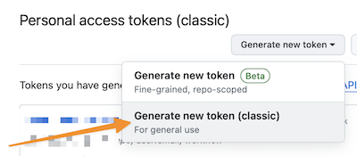
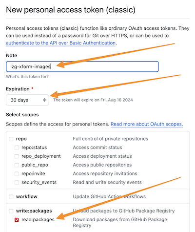

# Running In Docker

## Prerequisites

* Github Image Access &rarr; Access to IZG Github Image Repository via Personal Access Token to pull the Transformation
  Service image
* Store Files
    * Server Key Store
    * Client Trust Store
* A configuration file

### Github Image Access

Currently, the Transformation Service image repository is private. This means that you will need to have access granted,
which can be handled by the IZ Gateway development team at Audacious Inquiry

Assuming that access has been granted, you will need to setup a Personal Access Token in order to authenticate and pull
the Docker image.

**One** &rarr; Make sure you are logged into your Github account, then got to the tokens page
at https://github.com/settings/tokens

(You may also get to this page by clicking on your avatar at the top right, then Settings &rarr; Developer Settings
&rarr; Personal Access tokens &rarr; Tokens (classic))

**Two** &rarr; Click Generate new token &rarr; Generate new token (classic)



**Third** -&rarr; Configure & Generate the new token

Give the new token a name in the Note field and set an expiration. Then, check the box next to read:packages. This is
the only scope necessary to read images.



Click the _Generate token_ button at the bottom of the page.

**Fourth** &rarr; Copy the token and set environment variable

Once the token has been generated you will be taken to a page that displays the new token. You will ONLY be shown this
value once.

You will need this value in an environment variable called CR_PAT.

### Store Files

The Transformation Service makes use of two separate sets of certificate and key stores: the Server Key Store and the
Client Trust Store

Both the Server Key Store and Client Trust Store are formatted in Bouncy Castle File KeyStore (BCFKS) format to conform
to FIPS encryption requirements for media. JKS format is non-compliant for secret material.

Please _NOTE_ the following that pertain to both files:

* As of this writing the files have to be a specific name. This will be addressed in a future release.
* Both files needs to have the same password set for opening them, which will be used to set the COMMON_PASS environment
  variable when running the image.
* You'll need to place Server Key Store and Client Trust Store files in a location that can be accessed by the running
  Docker container. For our example let's say we put these in a /izgw-xform/ssl directory. This local directory will be
  mapped into the running container to /ssl, which will be the value we set the SSL_SHARE environment variable to.

#### Server Key Store

The Server Key Store is used to identify the Transformation Service to systems calling the Transformation Service and
validate the certificates those calling systems present.

Systems calling the hosted Transformation Service must have a certificate that has been issued by DigiCert that has been
provided by the IZ Gateway Security team. This enables the Transformation Service to identify trusted calling systems
because those certificates will all be "signed" by a single Certificate Authority. This also means that the hosted
Transformation Service does not need to change it's Server Key Store frequently (only when the Certificate Authority's
certificate has been renewed). Systems calling the Transformation Service should verify that the server certificate is
valid, and further will be asked to present their client certificate in order for the Transformation Service to ensure
the connection is coming from a trusted system.

The Server Key Store needs to be named _awsdev_keystore.bcfks_ (again the specific naming will be a addressed in a
future release)

#### Client Trust Store

When the Transformation Service makes a connection to the IZ Gateway, it will need to verify that it has made a
connection to a trusted system using the expected certificate. This is established by verifying that the server
certificate of the destination IZ Gateway is a trusted certificate by appearing in the Transformation Service Client
Trust Store.

The Client Trust Store needs to be named _izgw_client_trust.bcfks_ (again the specific naming will be addressed in a
future release)

### Configuration Files

The Transformation Service relies on three configuration files at this time: Organization, Pipelines, Solutions. These
ultimately determine the changes that will happen to data as it travels through the Transformation Service.

You may download example configurations from the repository as described here:

* Organizations &rarr; [organizations.json](/testing/configuration/organizations.json)
* Pipelines &rarr; [pipelines.json](/testing/configuration/pipelines.json)
* Solutions &rarr; [solutions.json](/testing/configuration/solutions.json)

You'll need to have these files located in a place that can be accessed by the running Docker container. For our example
let's say we put these in a /izgw-xform/configuration directory. This local directory will be mapped into the running
container to /configuration. That directory name (/configuration) and the name of the three files will be used to set
environment variables when running the image.

The three environment variables:

* transformationservice.configurations.organizations
* transformationservice.configurations.pipelines
* transformationservice.configurations.solutions

## Running Transformation Service Locally via Docker

### Authenticate

You will need the Personal access token that you setup earlier. You might want to save this in an environment variable:

```bash
export CR_PAT=ghp_REPLACEmeWithYourToken
```

Then you will need to authenticate:

```bash
echo $CR_PAT | docker login ghcr.io -u USERNAME --password-stdin
```

You should see a _Login Succeeded_ message

At this point you can move to the Run Image instructions. The first time you run it will pull the latest image.

### Run Image

To run the image we need to set a few environment variables used by the running container. Those are:

* transformationservice.configurations.organizations
    * This specifies the name and location on the running container of the configuration for Organizations. For our
      example we will look for the organizations.json in the /configuration folder. So we would set this to
      /configuration/organizations.json.
* transformationservice.configurations.pipelines
    * This specifies the name and location on the running container of the configuration for Pipelines. For our example
      we will look for the pipelines.json in the /configuration folder. So we would set this to
      /configuration/pipelines.json.
* transformationservice.configurations.solutions
    * This specifies the name and location on the running container of the configuration for Solutions. For our example
      we will look for the solutions.json in the /configuration folder. So we would set this to
      /configuration/solutions.json.
* SSL_SHARE
    * This specifies the directory on the running container where the Server Key Store and Client Trust Store are
      located. For our example we will look for these files in /ssl
* COMMON_PASS
    * This is the password which is necessary to open the Server Key Store and Client Trust Store
* TS_SERVER_PORT
    * This is the port that we want the Transformation Service to listen on. For our example we will use port 444
* transformationservice.destination
    * This is the downstream IZ Gateway Hub that we want the Transformation Service to submit messages to. For our
      example we will use https://dev.izgateway.org/IISHubService

To run the image we can issue a single docker command as follows:

```bash
docker run \
--env=COMMON_PASS=<PASSWORD> \
--env=SSL_SHARE=/ssl \
--env=transformationservice.destination=https://dev.izgateway.org/IISHubService \
--env=TS_SERVER_PORT=444 \
--env=transformationservice.configurations.organizations=/configuration/organizations.json \
--env=transformationservice.configurations.pipelines=/configuration/pipelines.json \
--env=transformationservice.configurations.solutions=/configuration/solutions.json \
--volume=/Users/moodya/Dev/Fed/izg/izgw-transform/src/main/resources:/configuration \
--volume=/Users/moodya/Dev/Fed/izg/dev.izgateway.org_stores/conf/ssl:/ssl \
-p 444:444 \
-d \
ghcr.io/izgateway/izgw-transform:latest
```

The first time you run the image you will see messages where Docker is pulling down the image and then running. So
output will be similar to:

```text
Unable to find image 'ghcr.io/izgateway/izgw-transform:latest' locally
latest: Pulling from izgateway/izgw-transform
d25f557d7f31: Already exists
9e36186fec5a: Already exists
14d453f422e7: Already exists
.
.
.
876a4ef3d3db: Pull complete
c214f187cb9f: Pull complete
33c3919a2226: Pull complete
Digest: sha256:57b124b5928ab7d0db1ca6c9f1101951f7ab3ceaa9d34d62114f3557b821444c
Status: Downloaded newer image for ghcr.io/izgateway/izgw-transform:latest
ded59e415a2b6ffe5523cd7aede89cbf61281bb3fe13e343be80f158fb76ceec
```

At this point you can run docker's ps command to see that the container is running:

```bash
docker ps -f name=local-xform
CONTAINER ID   IMAGE                                     COMMAND                  CREATED         STATUS         PORTS                                      NAMES
ded59e415a2b   ghcr.io/izgateway/izgw-transform:latest   "sh -c 'bash run.sh …"   2 minutes ago   Up 2 minutes   8000/tcp, 0.0.0.0:444->444/tcp, 9082/tcp   local-xform
```

## Generate Server Key Store

One of the files mentioned previously is the keystore that is needed to have the Transformation Service run. This file
must be named: _awsdev_keystore.bcfks_

Steps to create the keystore bcfks file:

* You should already have in your possession:
    * A key file in pem format and a cert file in pem format. For this example, we will use sample-private-key.pem and
      sample-cert.pem to represent these files.
* Create a .p12 file from your cert and key pem files:
    * ```openssl pkcs12 -export -in sample-cert.pem -inkey sample-private-key.pem -out sample-keystore.p12 -name "samplealias"```
* Create a .bcfks file using the following command:
    * ```keytool -importkeystore -srckeystore sample-keystore.p12 -srcstorepass 'password' -storepass 'password' -destkeystore awsdev_keystore.bcfks -deststoretype BCFKS -providername BCFIPS -provider org.bouncycastle.jcajce.provider.BouncyCastleFipsProvider -providerpath ./bc-fips-1.0.2.4.jar```
* Add the root ca cert to the bcfks file:
    * ```keytool -importcert -file DigiCertCA.crt -keystore awsdev_keystore.bcfks -storetype BCFKS -providername BCFIPS -provider org.bouncycastle.jcajce.provider.BouncyCastleFipsProvider -providerpath ./bc-fips-1.0.2.4.jar -storepass 'password' -alias DigiCertCA```
* Add the intermediate cert to the bcfks file
    * ```keytool -importcert -file TrustedRoot.crt -keystore awsdev_keystore.bcfks -storetype BCFKS -providername BCFIPS -provider org.bouncycastle.jcajce.provider.BouncyCastleFipsProvider -providerpath ./bc-fips-1.0.2.4.jar -storepass 'password' -alias TrustedRoot```
* To list the contents of the bcfks file:
    * ```keytool -list -keystore ./awsdev_keystore.bcfks -storepass 'password' -deststoretype BCFKS -providername BCFIPS -provider org.bouncycastle.jcajce.provider.BouncyCastleFipsProvider -providerpath ./bc-fips-1.0.2.4.jar```

## Generate Client Trust Store

You may already have a file that works for this if you are connecting to a dev or test IZ Gateway. However, as an
example, below are steps to generate this file to connect to the Development IZ Gateway hosted at dev.izgateway.org.

You will need:

* To be on a system with the ability to run openssl
* To be on a system with the ability to run keytool (this is available if you have Java installed)
* A bc-fips jar in order to produce the Bouncy Castle FIPS compliant file
    * The latest appropriate jar to use is in the docker/data folder

Steps to create the file

* Pull the public cert for the server using openssl:
    * ```openssl s_client -showcerts -connect dev.izgateway.org:443 </dev/null 2>/dev/null | openssl x509 -outform PEM > dev.izgateway.org.crt```
* Create the Client Trust Store using keytool
    * Notes about the keytool command below
        * Use the password that you intend to use as the COMMON_PASS environment variable where you see <PASSWORD>
        * Replace <PATH TO> to the location for the bc-fips jar file
    * ```keytool -import -alias dev.izgateway.org -keystore izgw_client_trust.bcfks -file dev.izgateway.org.crt -noprompt -storepass '<PASSWORD>' -deststoretype BCFKS -providername BCFIPS -provider org.bouncycastle.jcajce.provider.BouncyCastleFipsProvider -providerpath /<PATH TO>/bc-fips-1.0.2.4.jar```
