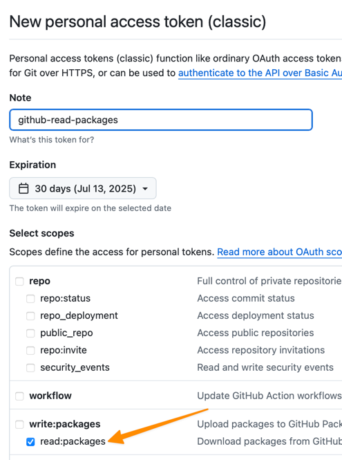

# Maven GitHub Packages Access

There are currently two dependencies (IZGW Core and v2tofhir) which are pulled in from GitHub. To pull these, you'll have to configure access in your local Maven.

For this, you will need a login to GitHub.

If you already have a GitHub personal access token with _read:packages_ scope which you would like to use skip to step 3.

## 1. Login to GitHub

## 2. Create GitHub Personal Access Token

In GitHub, navigate to Settings &rarr; Developer Settings &rarr; Personal access tokens 

This is also a direct link: https://github.com/settings/tokens

Click on Generate new token &rarr; Generate new token (classic):


Enter a name for the token and set an expiration date.  

The only scope needed for this token to be able to read the necessary packages for Transformation Service is _read:packages_. 



Click the _Generate token_ button at the bottom of the page and record the provided personal access token value.

## 3. Create/Update Maven settings.xml

We must now provide the personal access token to Maven. You will need to create or update your personal Maven settings file.

This file is named settings.xml and will live in the .m2 directory in your _home_ directory.

- Windows: ```C:\Users\[username]\.m2\settings.xml```
- Mac: ```/Users/[username]/.m2/settings.xml```
- Linux: ```/home/[username]/.m2/settings.xml```

We need to add two _servers_ to this file which correspond to repositories in [pom.xml](../pom.xml) file. 

The full settings.xml necessary for building Transformation Service:

```xml
<?xml version="1.0" encoding="UTF-8"?>
<settings xmlns="http://maven.apache.org/SETTINGS/1.0.0"
          xmlns:xsi="http://www.w3.org/2001/XMLSchema-instance"
          xsi:schemaLocation="http://maven.apache.org/SETTINGS/1.0.0 http://maven.apache.org/xsd/settings-1.0.0.xsd">
    <servers>
        <server>
            <id>github</id>
            <username>your-github-username</username>
            <password>token-from-step-2</password>
        </server>
        <server>
            <id>v2tofhir</id>
            <username>your-github-username</username>
            <password>token-from-step-2</password>
        </server>
    </servers>
</settings>
```

You would replace _your-github-username_ with your actual GitHub username.

You would replace _token-from-step-2_ with the token you generated in Step 2 above.

It is possible that you already have a settings.xml.  In this case you would need to add the two _\<server\>_ entries in the example. 
