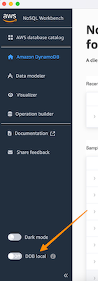

# Transformation Service Data Storage

The purpose of this document is to explain how the Transformation Service stores the configuration necessary for its proper operation.

There are currently two storage options:

1. File-based (in JSON files)
2. AWS DynamoDB

There is also the opportunity to have the system migrate data from files to DynamoDB. Please note that this is a one way migration, you are able to migrate data from existing files to DynamoDB but not from DynamoDB back to files.

## Configuration

The type of storage is configured via the SPRING_DATABASE environment variable. There are currently three options for this setting:

- file
  - This is the default is the environment variable is not set TODO
- dynamodb
- migrate

### File-based Storage Configuration

To use file-based storage, SPRING_DATABASE will need to be set to ```file```.

In addition, each entity type's file location will need to be configured. These environment variables are:

- XFORM_CONFIGURATIONS_ORGANIZATIONS
- XFORM_CONFIGURATIONS_PIPELINES
- XFORM_CONFIGURATIONS_SOLUTIONS
- XFORM_CONFIGURATIONS_MAPPINGS
- XFORM_CONFIGURATIONS_ACCESS-CONTROL
- XFORM_CONFIGURATIONS_OPERATION-PRECONDITION-FIELDS
- XFORM_CONFIGURATIONS_USERS
- XFORM_CONFIGURATIONS_GROUP-ROLE-MAPPING

### AWS DynamoDB Storage Configuration

To use DynamoDB storage, SPRING_DATABASE will need to be set to ```dynamodb```.

In addition, you may also configure the following amazon related items:

- AMAZON_DYNAMODB_ENDPOINT
  - This is the URL for the DynamoDB endpoint. If not set, the endpoint is determined by the application from the AWS account and region information.
  - When running locally for development and testing, this would be set to http://localhost:8080/
- AMAZON_DYNAMODB_TABLE
  - The name of the table to use. If not set, the default is izgw-hub
  - Please see the _AWS DynamoDB Table Setup_ section in this document for details on this setup

#### AWS DynamoDB Table Setup

The DynamoDB table required for Transformation Service requires these settings for the Partition Key and Sort Key:

- Partition Key - Needs to be a String and named entityType
- Sort Key - Needs to be a String and named sortKey

Following are the current recommended settings:

```json
{
  "AttributeDefinitions": [
    {
      "AttributeName": "entityType",
      "AttributeType": "S"
    },
    {
      "AttributeName": "sortKey",
      "AttributeType": "S"
    }
  ],
  "TableName": "izgw-hub",
  "KeySchema": [
    {
      "AttributeName": "entityType",
      "KeyType": "HASH"
    },
    {
      "AttributeName": "sortKey",
      "KeyType": "RANGE"
    }
  ],
  "TableStatus": "ACTIVE",
  "ProvisionedThroughput": {
    "ReadCapacityUnits": 10,
    "WriteCapacityUnits": 10
  },
  "TableClassSummary": {
    "TableClass": "STANDARD"
  },
  "DeletionProtectionEnabled": true
}
```

Command to create a table named ```izgw-hub``` using the recommended settings:

```shell
aws dynamodb create-table \
  --table-name izgw-hub \
  --attribute-definitions \
    AttributeName=entityType,AttributeType=S \
    AttributeName=sortKey,AttributeType=S \
  --key-schema \
    AttributeName=entityType,KeyType=HASH \
    AttributeName=sortKey,KeyType=RANGE \
  --provisioned-throughput \
    ReadCapacityUnits=10,WriteCapacityUnits=10 \
  --table-class STANDARD \
  --deletion-protection-enabled
```

#### AWS Permissions

When running this application in AWS, you will need to ensure that the IAM role it is running under has the proper permissions to interact with data stored in DyanamoDB.

The following permissions should cover what is needed:

- dynamodb:GetItem
- dynamodb:PutItem
- dynamodb:UpdateItem
- dynamodb:DeleteItem
- dynamodb:Query
- dynamodb:Scan
- dynamodb:BatchGetItem
- dynamodb:BatchWriteItem

### Migration Configuration

If you have existing configuration in files, you may have the application do a migration to DynamoDB.

You would set SPRING_DATABASE to ```migrate```.

In addition, you will need to configure the options spelled out in the File-based and DynamoDB sections above. This is so that the application will know where to find the files containing data to migrate to DynamoDB.

#### Migration Steps

This assumes running multiple ECS containers

1. Ensure the necessary DynamoDB table (See _AWS DynamoDB Table Setup_ section)
2. Leave an existing, file-based task running so that the system is processing requests during migration
3. Configure ECS task definition for migration as detailed above
4. Start a new ECS task in the service using the migration definition
5. Verify the updated ECS task started property and that the migration completed successfully
6. Configure the ECS task definition for dynamodb as detailed above
7. Have _all_ instances start with the new dynamodb ECS task definition
8. Verify the system is operational via smoketest

The above assumes you are running multiple ECS containers. If you are running a single node, you would update the task definition for migration and restart the node. At some point coming back to change the task definition to just dynamodb.

#### Example Migration Log

When the application is started in Migration mode, you will be able to see log entries detailing what it is working on.

A shortened example follows:

```
Creating migrator for GroupRoleMapping with file path: testing/configuration/group-role-mapping.json
Creating migrator for Organization with file path: testing/configuration/organizations.json
Creating migrator for OperationPreconditionField with file path: testing/configuration/operation-precondition-fields.json
Creating migrator for User with file path: testing/configuration/users.json
Creating migrator for Solution with file path: testing/configuration/solutions.json
Creating migrator for Pipeline with file path: testing/configuration/pipelines.json
Creating migrator for AccessControl with file path: testing/configuration/access-control.json
Creating migrator for Mapping with file path: testing/configuration/mappings.json
Starting Data Migration from File Storage to DynamoDB
Starting data migration for 8 entity types
Migrating GroupRoleMapping...
Found 6 GroupRoleMapping entities in file storage
Migrated GroupRoleMapping: fe65c254-eeee-4d41-a81c-187847a10dd0
<REMOVED VERBOSENESS>
Migrated GroupRoleMapping: 7b23ee9e-ba1a-43f7-9290-2b6a3dccaf32
Successfully migrated 6/6 GroupRoleMapping (0 skipped)
Migrating Organization...
Found 18 Organization entities in file storage
Migrated Organization: 19c3dd20-31f4-4508-87ee-705fca9603b3
<REMOVED VERBOSENESS>
Migrated Organization: 03adf8af-c182-4ad6-8707-f62efdebf96e
Successfully migrated 18/18 Organization (0 skipped)
Migrating OperationPreconditionField...
Found 7 OperationPreconditionField entities in file storage
Migrated OperationPreconditionField: b8f6adcb-ffa4-4793-a157-ffc2db85da7b
<REMOVED VERBOSENESS>
Migrated OperationPreconditionField: 07d52845-6c34-4318-a8c9-2117072ca6e3
Successfully migrated 7/7 OperationPreconditionField (0 skipped)
Migrating User...
Found 9 User entities in file storage
Migrated User: 4f5b1f8e-6c7d-4a9b-8e3f-2d7c6b5a9e4d
<REMOVED VERBOSENESS>
Migrated User: 0d7fa94b-3804-4de2-b729-bd153e7f68c3
Successfully migrated 9/9 User (0 skipped)
Migrating Solution...
Found 10 Solution entities in file storage
Migrated Solution: 79def078-5953-4d31-b44a-79d4da9beef9
<REMOVED VERBOSENESS>
Migrated Solution: 64bc92f4-053c-4e55-85b5-5ff52f5ff47f
Successfully migrated 10/10 Solution (0 skipped)
Migrating Pipeline...
Found 12 Pipeline entities in file storage
Migrated Pipeline: ef034c0d-1d64-4971-8068-7ab1567b11ea
<REMOVED VERBOSENESS>
Migrated Pipeline: 08ddcc59-cd1c-4643-803a-51d6b328f32f
Successfully migrated 12/12 Pipeline (0 skipped)
Migrating AccessControl...
Found 7 AccessControl entities in file storage
Migrated AccessControl: b8a2c7e9-5d6f-4e3c-9b2a-1d7e8f3c5b9d
<REMOVED VERBOSENESS>
Migrated AccessControl: a7d3ef19-5283-47de-b67c-bfa88d0bb0c2
Successfully migrated 7/7 AccessControl (0 skipped)
Migrating Mapping...
Found 4 Mapping entities in file storage
Migrated Mapping: ace4066b-44be-4765-83f4-a05fcfe5774d
<REMOVED VERBOSENESS>
Migrated Mapping: e2f1c811-b8d3-455a-8c7e-521e5929a884
Successfully migrated 4/4 Mapping (0 skipped)
Migration completed successfully: 73/73 entities migrated (0 skipped)
Data Migration Completed Successfully
```

You'll be able to see the steps as it works.  With a summary at the end of how many entities have been migrated.

## Running Locally

To develop and test locally, you can run DynamoDB either via the NoSQL Workbench or through Docker.

### Run DynamoDB

NoSQL Workbench can be found here: https://docs.aws.amazon.com/amazondynamodb/latest/developerguide/workbench.settingup.html

When running NoSQL Workbench, you should see an option on the main screen on the bottom left that will allow you to toggle running locally:



### Configuration

There are 4 properies you'll need to set via your environment in order to connect to DynamoDB locally:

- AMAZON_DYNAMODB_ENDPOINT 
  - Tells the application where to connect to the local DynamoDB. By default, the local DynamoDB will run on port 8000 so you would set this variable to ```http://localhost:8000```
- AWS_ACCESS_KEY_ID
  - Required to exist even if we are connecting locally. This doesn't need to be a valid access key, you can set this to literally a string like ```dummy```
- AWS_SECRET_ACCESS_KEY
  - Required to exist even if we are connecting locally. This doesn't need to be a valid access key, you can set this to literally a string like ```dummy```
- AWS_REGION
  - Required even running locally and must be a valid region. You can use ```us-east-1```

### Creating Table Locally

A table can be created locally using a modification on the command specified earlier:

```shell
aws dynamodb create-table \
  --table-name izgw-hub \
  --attribute-definitions \
    AttributeName=entityType,AttributeType=S \
    AttributeName=sortKey,AttributeType=S \
  --key-schema \
    AttributeName=entityType,KeyType=HASH \
    AttributeName=sortKey,KeyType=RANGE \
  --provisioned-throughput \
    ReadCapacityUnits=10,WriteCapacityUnits=10 \
  --table-class STANDARD \
  --deletion-protection-enabled \
  --endpoint-url http://localhost:8000
```

Note that you _will_ need to have the AWS Region and Credentials set (even if we are connecting locally).

You can specify them by setting the following environment variables:

- AWS_ACCESS_KEY_ID
  - Required to exist even if we are connecting locally. This doesn't need to be a valid access key, you can set this to literally a string like ```dummy```
- AWS_SECRET_ACCESS_KEY
  - Required to exist even if we are connecting locally. This doesn't need to be a valid access key, you can set this to literally a string like ```dummy```
- AWS_REGION
  - Required even running locally and must be a valid region. You can use ```us-east-1```

### Example Docker Compose

If you want to run DynamoDB inside Docker, this is an example docker compose file:

```yaml
services:
 dynamodb-local:
   command: "-jar DynamoDBLocal.jar -sharedDb -dbPath ./data"
   image: "amazon/dynamodb-local:latest"
   container_name: dynamodb-local
   ports:
     - "8000:8000"
   volumes:
     - "./docker/dynamodb:/home/dynamodblocal/data"
   working_dir: /home/dynamodblocal
```

## Package

The [gov.cdc.izgateway.xform.repository](https://github.com/IZGateway/izgw-transform/blob/f97d2918bd031a55de081c907341811ed82b6749/src/main/java/gov/cdc/izgateway/xform/repository) package contains the code for Tranformation Service storage.

