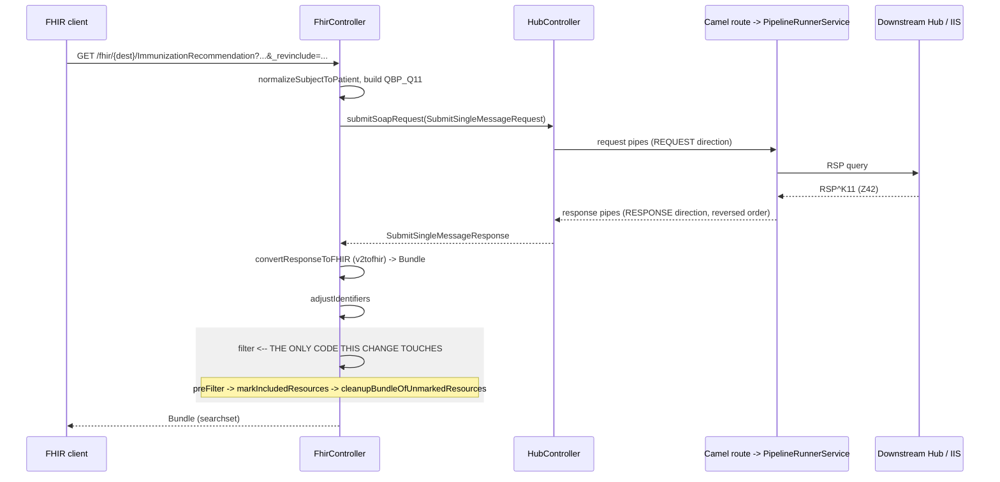

## Context

See `proposal.md` — Why, and `specs/fhir-searchset-filtering/spec.md` for the behaviour contract.

All of the affected code is the searchset filter in
`src/main/java/gov/cdc/izgateway/xform/endpoints/fhir/FhirController.java`. It runs on the response
side of a FHIR query, entirely downstream of the transformation pipeline:

Two consequences of that position, both of which keep this change small:

- **The pipeline is upstream and unaffected.** Pipe ordering, `DataFlowDirection.RESPONSE` reversal,
  and the `x-loopback: true` short-circuit all happen inside `submitSoapRequest`, before
  `convertResponseToFHIR` is reached. `filter` sees only the converted bundle. Loopback is a SOAP-path
  header and is not reachable from the FHIR endpoints, so it needs no handling here.
- **No crypto, no observability, no persistence.** Nothing in `filter` touches BCFIPS providers,
  keystores, or SSL reload, so the FIPS constraints do not bear on it. `filter` and its helpers carry
  no `@CaptureXformAdvice`, so no AspectJ pointcut changes and no javaagent implications. The
  configuration model is untouched, so neither the file nor the DynamoDB repository backend is
  involved and there is no `SPRING_DATABASE=migrate` implication.

Three facts about the current implementation shape the approach:

1. **The reference graph already exists.** `v2tofhir` stamps each resource with a `References` and a
   `Reverses` `Set<Reference>` in `userData`, and each `Reference` carries its target under the
   `Resource` user-data key. `markIncludedResources` already walks it. No traversal or FHIRPath code
   is needed to answer "what does this retained entry point at".
2. **Removal happens in two places, at two different times.** `preFilter` physically removes
   conversion-created resources from the bundle (`removeInfrastructureCreatedResources`, the
   `it.remove()` at `:1120`) *before* anything knows which resources will be retained.
   `cleanupBundleOfUnmarkedResources` removes everything still unmarked *after*. The subject `Patient`
   dies in the second; the schedule `Organization` dies in the first.
3. **`markIncludedResources` grows its worklist as it iterates** (`for (int i = 0; i < resources.size(); i++)`),
   so anything added to `resources` is itself traversed. Reachability closure is already transitive.

## Goals / Non-Goals

**Goals:**

- Fix both defects at the filter, so every FHIR query endpoint is covered by one change rather than
  the Z42 path only.
- Keep the change additive from a client's point of view: entries may be added and a `search.mode`
  label corrected, but no resource content is altered or removed relative to today.
- Reduce the number of places a resource can be removed from the searchset, so the reference
  integrity guarantee is checkable in one place.

**Non-Goals:**

- No new class, no new configuration property, no new dependency.
- No change to `toIncludeList` / `normalizeInclude` `_include` parsing, or to `includeMatches`
  resolution semantics. The search names the conversion registers are `v2tofhir`'s concern; a
  parameter that matches nothing today still matches nothing.
- No pagination or bundle-size limit. Out of scope even though this change can grow bundles.

## Decisions

### 1. Fix at the filter, not on the Z42 path

Both defects are properties of the searchset filter, and the filter is shared by `/Immunization`,
`/ImmunizationRecommendation`, `/Patient`, and `Patient/$match`. The field report reached them
through Z42, but `Immunization.patient` (also 1..1) dangles identically on the `/Immunization` path.

*Alternative considered:* special-case `ImmunizationRecommendation` to retain its `patient` and
`authority`. Rejected — smaller in the ticket, larger in total, because it leaves the identical
defect on every sibling endpoint and adds a resource-type branch to code that is currently
type-agnostic.

### 2. `SearchEntryMode.INCLUDE` in `checkReferences`

One token, at `FhirController.java:1182`. `checkReferences` is reached only from
`markIncludedResources`, and only for a resource that satisfied an `_include` or `_revinclude` —
which is the definition of `include` in R4. There is no path through it that should produce a
`match`; resources of the requested type are labelled by `preFilter` before `checkReferences` runs,
and `preFilter` wins because it labels the bundle entry directly while `checkReferences` labels
resource `userData` that `cleanupBundleOfUnmarkedResources` only applies when the entry's mode is
still null (`:1159`).

### 3. Close the reference graph by **retaining** the target, not by stripping the reference

To satisfy "A returned searchset contains no dangling references" there are exactly two mechanisms:
add the missing resource to the bundle, or remove the `reference` element that points at it. Chosen:
retain the resource, with `search.mode = "include"`.

*Rationale:*

- **Additive rather than destructive.** Retaining only adds entries. Stripping would delete a
  `Reference.reference` element that `v2tofhir` populated — a silent content change for any client
  reading that field today.
- **R4 sanctions it explicitly:** "the server has the prerogative to return additional search results
  if it believes them to be relevant." A resource that a returned resource points at is relevant by
  construction.
- **It is what the field validation asked for**, having looked at real Nevada and Alaska responses.

*Alternative considered — strip `reference`, keep `identifier` + `display`:* this is a legal R4
logical reference, it satisfies the 1..1 cardinality on `patient` (the element is still present), it
grows no bundle, and it preserves the existing "the enriched reference is enough for production use"
stance at `:1118` exactly. It was rejected on the additive-vs-destructive point above, but it remains
the right tool for a target that genuinely cannot be retained — see Decision 5 and the first risk.

### 4. Unify removal into `cleanupBundleOfUnmarkedResources`

Because `preFilter` removes conversion-created resources before retention is known (Context fact 2),
"keep it if something references it" is unanswerable at that point. Rather than teach `preFilter` to
look ahead, invert it: stop removing in `preFilter`, and let the single existing sweep in
`cleanupBundleOfUnmarkedResources` remove whatever is still unmarked once marking is complete.

`removeInfrastructureCreatedResources` reduces to its white-list half — mark
`Resource:source:<type>` hits `INCLUDE`, and otherwise do nothing. The `Provenance` carve-out at
`:1113` is then dead code and comes out: it exists only to skip an `it.remove()` that no longer
happens, and the `_revinclude=Provenance` it protects is handled by ordinary include marking either
way. Net effect is fewer lines and one removal site instead of two, which also keeps
`preFilter`'s cyclomatic complexity down rather than up.

*Alternative considered:* a pre-pass that computes the retained set, then let `preFilter` consult it.
Rejected — that is a second traversal of the same graph `markIncludedResources` already walks.

### 5. Reachability closure is unconditional, and runs where include marking already runs

In `markIncludedResources`, after the two `checkReferences` calls, walk the same `References` set
once more and retain every target that is not already retained, marking it `INCLUDE`. The existing
growing-worklist loop makes this transitive for free (Context fact 3), which is required: if a
retained `Patient` itself references a `managingOrganization`, that reference must resolve too.

Guard for a null target — `ref.getUserData("Resource")` is null for any reference the conversion did
not build through `ParserUtils.toReference`. Such a target cannot be retained, so it is the one case
where Decision 3's rejected alternative applies; see the first risk.

Only *forward* references are closed. `Reverses` is not walked unconditionally, and must not be: the
92 forecast `Observation` resources reach the recommendation through `Reverses`, not `References`, so
they stay out of a plain `GET /ImmunizationRecommendation` — which the spec requires and which is the
whole point of the item-3 non-goal in the proposal.

### 6. Checkstyle

`ai-checkstyle.xml` fails the build at `validate`. The relevant limits here are cyclomatic complexity
and `MultipleStringLiterals` (max 3–4). Decision 4 removes branches from `preFilter` /
`removeInfrastructureCreatedResources`, and Decision 5 adds a short loop to `markIncludedResources`,
so complexity should net out flat or lower. The `"Resource"` and `"References"` user-data keys are
already repeated string literals in this file; the new code SHALL reuse extracted constants rather
than add another occurrence of either.

## Risks / Trade-offs

- **A reference whose target was never in the bundle still dangles.** Decision 5 can only retain a
  resource the bundle actually holds. → Verification must assert the guarantee over real captures
  rather than assume it. If a capture exposes such a reference, apply Decision 3's alternative
  narrowly — clear `Reference.reference` on that reference, leaving `identifier` and `display` — as a
  final sweep in `cleanupBundleOfUnmarkedResources`. Scoped to targets that cannot be retained, this
  stays small and does not reopen Decision 3.
- **`/Immunization` bundles grow, by an amount nobody has measured.** A Z32 with N administered doses
  can now retain the performer `Practitioner` and `Location` each dose references, where today those
  are dropped and only the enriched reference survives. → Measure against the `ehex-testing` captures
  before merging, both endpoints, entry counts before and after. The bound is the reference graph of
  the matched resources, not the message: the Observations are excluded by Decision 5, so the Nevada
  Z42 case grows by two entries, not eighty. If `/Immunization` growth proves unacceptable, the
  containment is to restrict unconditional closure to targets without a `Parser.SOURCE` marker and
  apply the reference-stripping fallback to the rest — a change to one predicate.
- **This partially reverses the deliberate stance at `:1118`** that an enriched reference is enough
  for production use. → It is narrowed rather than abandoned: a conversion-created resource is now
  retained only when a *retained* entry actually points at it, and is still dropped otherwise. The
  `Resource:source:<type>` white-list keeps its meaning for the unreferenced case.
- **The `search.mode` label change is client-visible.** A client selecting entries by
  `mode == "match"` will now see fewer entries from an `_include` / `_revinclude` query. → That is the
  intended correction and the reason the proposal marks it BREAKING; the previous label was a spec
  violation. Call it out in the release notes.
- **The behaviour has no test coverage on either side of the boundary.** No test in `src/test`
  references `_include` or `_revinclude`, none has a Z42 fixture, and none asserts on `Immunization`
  or `ImmunizationRecommendation` bundle content. → The fixture is a prerequisite of the change, not
  a follow-up; `tasks.md` sequences it before the code edits.

## Migration Plan

No data migration, no configuration change, no coordinated deploy — the change is confined to
response assembly in one service. Ship in the normal `feature -> develop -> Release-* -> main` flow.
Rollback is redeploying the previous image; nothing persists across the change, so a rollback simply
restores the previous labelling.

Two sequencing notes:

- Independent of the `v2tofhir` `2.4.0` -> `2.5.0` bump, which the user is handling separately. The
  fixes are correct against both versions. Adding the Z42 test fixture, however, is most useful
  against `2.5.0`, since only there does a Z42 produce the history/forecast split the fixture should
  assert on.
- Release notes must carry the `match` -> `include` labelling change for `_include` / `_revinclude`
  consumers.
